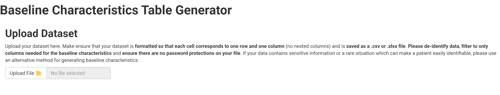
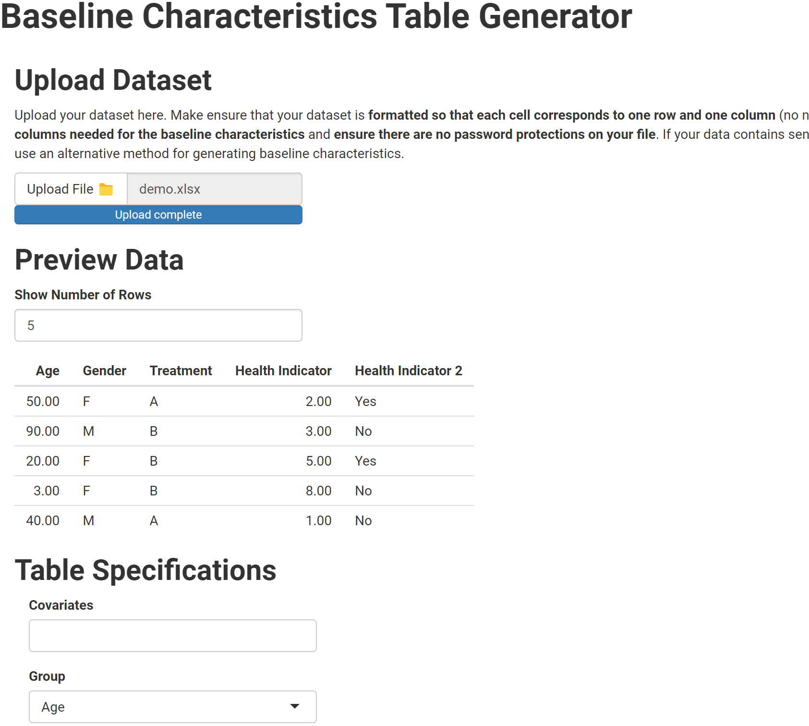

# Baseline Characteristics Table App 

This shiny application enables user to create a baseline characteristics table after uploading a .csv or .xlsx file 

## Demo

### File Upload 

Upload data saved in .csv or .xlsx file

After upload, you can see a data preview with the first 5 rows by default. You change the number of rows to expand preview. 

### 
###

[App](https://samiaab1990.github.io/baseline-characteristics/)
