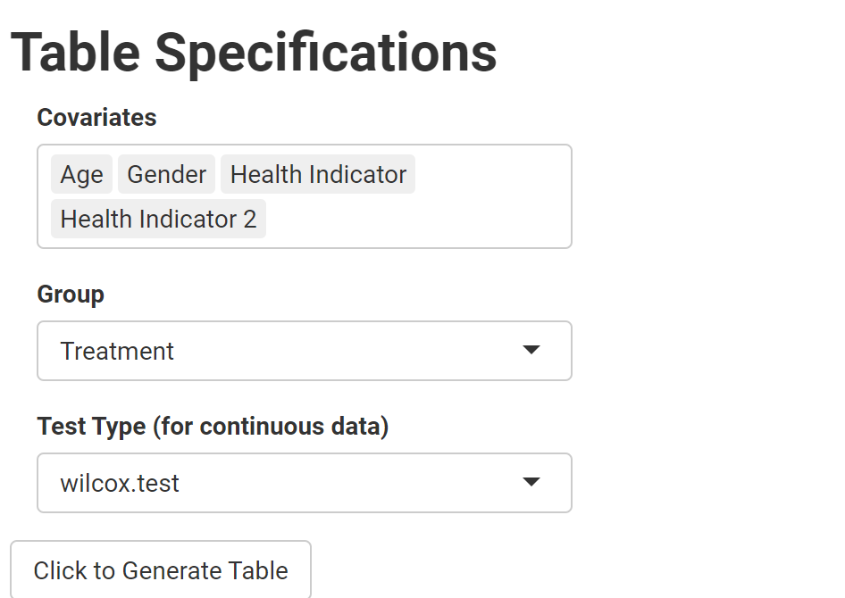

# Baseline Characteristics Table App 

The baseline characteristics table app allows the generation of a baseline characteristics table with user inputs. Developed with R Shiny using the `gtsummary` package. 

## Demo

### File Upload 

Upload data saved in .csv or .xlsx file

After upload, you can see a data preview with the first 5 rows by default. You change the number of rows to expand preview. 

### User Input

After file upload and preview, you can select:

- <b>Covariates</b>: the variables to compare between the groups

- <b>Grouping variable</b>: The variable to group the data by
  
- <b>Test/b> Select wilcoxon rank sum or t-test as tests of choice for continuous variables.
  

###

[App](https://samiaab1990.github.io/baseline-characteristics/)
